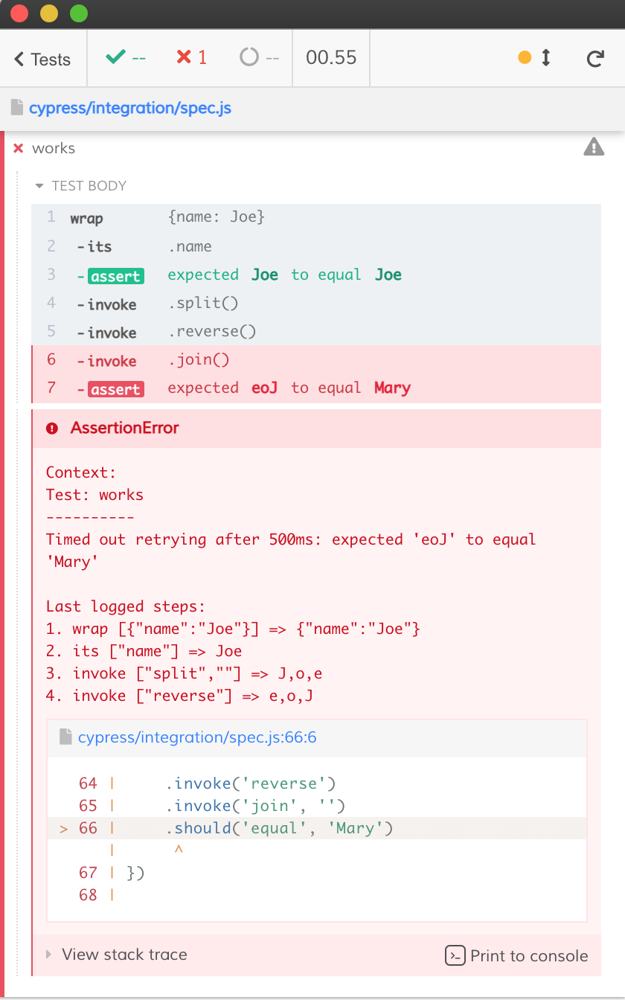

# cypress-steps

See [cypress/integration/spec.js](./cypress/integration/spec.js)

Because I read [Custom Steps and Error in Cypress](https://www.qacourse.dev/articles/custom-steps-and-error-in-cypress) and it reminded me of [cypress-failed-log](https://github.com/bahmutov/cypress-failed-log)
